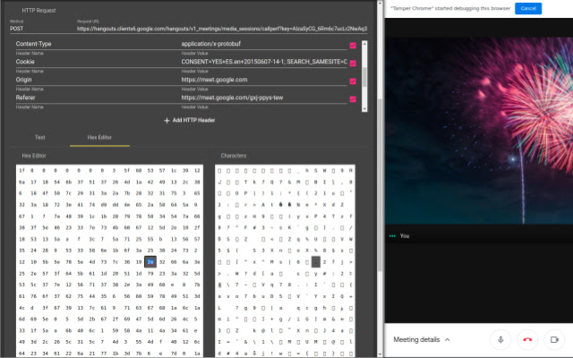
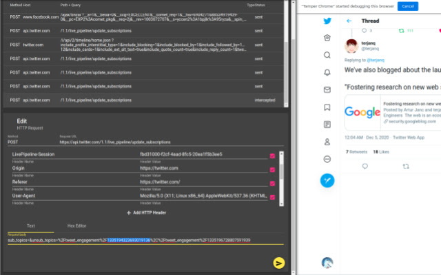
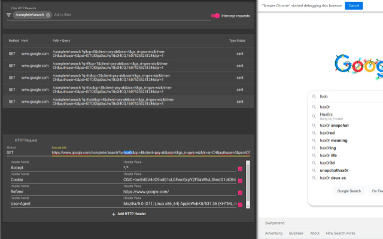
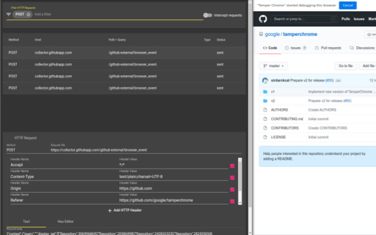
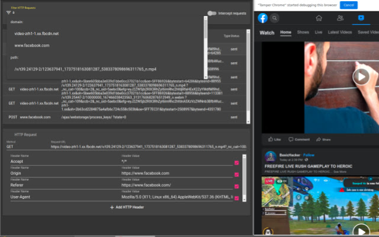

# Tamper DEV
Tamper Dev is an extension that allows you to edit HTTP/HTTPS requests and responses as they happen without the need of a proxy.

Press Alt+T or click on the extension button, and you'll be able to filter requests. Once you have a filter you like, enable interception, and you'll be able to modify all requests before they are sent to the server and before the responses are sent back to the browser.

| | | |
|---|---|---|
| Tamper with the requests sent by your browser, even if encrypted | Observe how the server reacts to your modifications, interactively | Modify the response that your browser receives from the server |

## Preview

<iframe width="560" height="315" src="https://www.youtube.com/embed/YNAt6kHm3yo?rel=0&modestbranding=1&controls=0" frameborder="0" allow="accelerometer; autoplay; clipboard-write; encrypted-media; gyroscope; picture-in-picture" allowfullscreen></iframe>

## FAQ

### Q. How to open Tamper Dev?
 - A. Press Alt+T or click on the extension icon.

### Q. Can I change the keyboard shortcut?
 - A. Yes, go to `chrome://extensions/shortcuts`

### Q. I have another question
 - A. Please submit it [here](https://github.com/google/tamperchrome/discussions/new).

## Features

| Edit the request or response body |
| --- |
|  |
|  |

| Modify the URL and headers being requested |
| --- |
|  |

| Use filters to specify the requests to be intercepted |
| --- |
|  |
|  |

